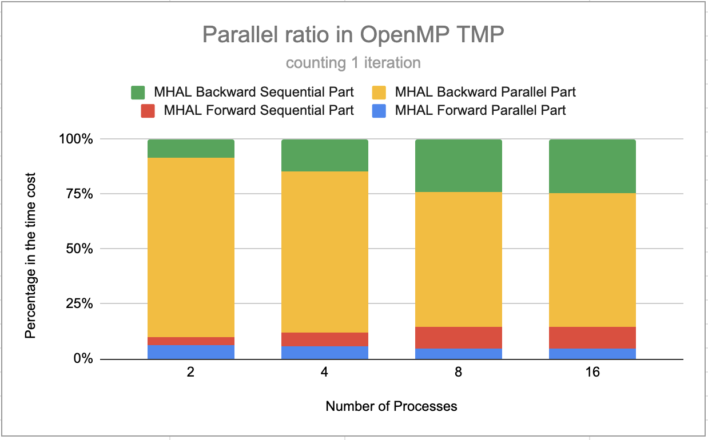

#### [Back to Peoject Page](../index.md)

## Final Report: Parallelizing Transformer with Tensor Model and Pipeline Parallelism

Team Name: Extreme Weather

Team Member:

- Yadi Xiao (yadix@andrew.cmu.edu)
- Hao Ren (haoren@andrew.cmu.edu)

## URL

[https://xyd18.github.io/ExtremeWeatherProject/](https://xyd18.github.io/ExtremeWeatherProject/)

## Summary

- The project aims to parallelize the training process of Transformer encoder layers, leveraging Tensor Model Parallelism and Pipeline Parallelism.
- We implement parallel versions of key components of the Transformer encoder layer, including Multi-Head Self-Attention, Position-wise Feed-Forward Network, and Layer Normalization, using Tensor Model and Pipeline parallelism.
- The best speedup for 24 layers of transformer encoder is 4.82x, which was obtained by utilizing 4 processes to execute pipeline model parallelism and each process used 12 threads to run tensor model parallelism inside a single layer; while inside a single Transformer Encoder, we can achieve close to linear speedup performance, with 7.42x speed-up using 8 processes.

## Background

In this section, we introduce the Transformer model and different parallelizing techniques. We also introduce related works about these techniques that we draw our ideas from.

### Transformer Model

The Transformer architecture[^1] has become the foundation for many natural language processing (NLP) tasks and applications, including language translation, text generation, and language understanding. The Transformer model’s success is primarily attributed to its ability to process sequences of data in parallel and learn long-range dependencies. However, as the scale of NLP tasks and the size of Transformer models grow, the computational demands of training and inference also increase, requiring parallelization across multiple GPUs to achieve satisfactory performance.

The primary component of the Transformer architecture is the Transformer encoder layer, which consists of two sub-layers: the Multi-Head Self-Attention mechanism and the Position-wise Feed-Forward Network. Each Transformer encoder layer can processes input sequences (e.g., words or tokens) in parallel to capture contextual information. Hence, the key data structure in our project is the Transformer encoder. Most computations on this data structure are related to Matrix Multiplication, element-wise addition, normalization, .etc.

To train the increasingly large model today, we cannot rely on Data Parallelism solely. Data parallelism partitions data input across multiple processing units and exploits inherent parallelism by computing these data segments together at the same time. However, Data parallelism requires the entire model to be replicated on all processing units, which can be difficult given the fact that today's Large Language Model has super huge sizes. Hence, other methods like Model parallelism, Tensor Model parallelism, and Pipeline Parallelism are introduced. It is worth noting that different parallelism techniques can be used together in suitable cases to achieve better parallelism.

### Tensor Model Parallelism

Tensor Model parallelism is introduced as an intra-layer parallelism technique. We can partition the layer into different parts, and assign parts to our processing units. Data will be communicated across these processing units, and they operate on their own parts of the layer. Under such a design, there is no need to communicate the weights of the model with other processing units, allowing us to store a potentially too-large layer across different processing units. We followed the Tensor Model Parallelism introduced in NVIDA’s Megatron [^2]. In particular, there are two layers in the Transformer structure that have inherent parallelism to explore: Feed Forward Layer and Multi-Head Attention Layer.

The Feed Forward layer has two Linear layers with a Relu calculation in between. Following notations are used in order to explain how Tensor Model Parallelism works in this layer: Let X be the input of the layer and its shape (B, n, dm), where B is the batch size, n is sequence length and dm is the output dimension of the previous layer. We have W1, the first linear layer’s weights, whose shape is (dm, h), and h is the hidden size (output size) of the linear layer. Similarly, we can have the second linear layer’s weights, whose shape is (h, dm). Normally, the output of the Feed Forward layer, O, is calculated as the following: O = Relu(X * W1) * W2, where * means matrix multiplication here. 

<figure>
 
 <figcaption>Partitioning the Feed Forward Layer using Tensor Model Parallelism</figcaption>
</figure>

For Tensor Model parallelism, we can partition the W1 vertically along the cols, and partition the W2 horizontally along the rows. Assume we have nproc processing units, each processing unit will have a W1 of (dm, h / nproc) and a W2 of (h / nproc, dm). As shown in Figure above, each processing unit will get an input X, and simply compute Relu(X * W1) * W2. The amazing part of this design is that we do not have to perform communication between calculations of two linear layers. The output of the first linear layer (in lecture slides, we call this partition output) amazingly suits the input requirements for the second linear layer (in lecture slides, we call this reduced output). We thus only need to perform a Reduce at the end to form the complete output. As a result, the only communication between processing units is the initial broadcast and the final reduction. 

The backward pass of the Feed Forward layer can be parallelized using Tensor Model parallelism in the exactly same way. The computation-intensive part of this process lies in the matrix multiplication calculation. The first advantage of parallelism in this layer is that we can speed up the computation. Each processing unit has a smaller matrix to compute during Matrix Multiplication, and thus mitigate its computational complexity. Secondly, we can separate the layer into multiple processing units, and thus mitigating the challenge of storing a super large layer. 

Multi-Head Attension Layer has inherent Tensor model parallelism to explore. We know that the final result of a Multi-Head Attension Layer is actually a concatenation of the Self-Attention result computed from heads on the last dimension, multiplied with a final parameter matrix. Each head’s computation is actually independent. This leaves room for parallelism to explore. As shown in Figure above, We can partition heads into different processing units, and let each processing units perform Self-Attention computation.  We will use the following notations to explain the Tensor Model parallelism here: 

- X, input, shape (B, n, dm), where B is the batch size, n is sequence length and dm is the output dimension of the previous layer
- V1, Q1, K1 are learnable parameter matrixes to form QKV matrix for the first head. V1 has shape (d, dv), Q1 and K1 have shape (d, dk). Here dv is the dimension of the value of the attention layer and dk is the dimension of the key, as required by the Transformer architecture. 
- Y is the parameter matrice for the last projection. In the normal Multi-Head Attension layer, Y is multiplied by the concatenated result of Self-Attention output from all heads.

<figure>
 
 <figcaption>Partitioning the Multi-Head Attention Layer using Tensor Model Parallelism</figcaption>
</figure>

The cool thing here is that Y can be partitioned into processing units as well. Each processing unit will maintain a partition of Y, which has (dv, dm) shape. This is another Tensor Model Parallelism with reduced output. After each head performs its Self-Attention calculation, it multiplies the output with partial Y, and then results are reduced globally to form the complete output. As a result, there is only two communication in this layer: one at the beginning to distribute the input, and another at the end to form the complete output.

The expensive computation here is related to the matrix multiplication among X, V1, Q1, K1, and Y1 (taking the first head as an example). Tensor model parallelism firstly speeds up the computation, as each processing unit now computes one or a few heads instead of all. Secondly, just as mentioned above, we avoid saving a potentially large layer in one unit. 

### Model Parallelism

Model parallelism seeks to partition the entire model across multiple machines in the granularity of operators and layers. In our opinion, the main difference between Model Parallelism and Tensor Model Parallelism is that Tensor Model parallelism partition a single layer across processing units, where Model parallelism partition layers across processing units. A Vision Transformer [^3] is built using layers of Transformer Encoder. If we split the model across multiple machines, each machine might store certain layers. For example, if there are 12 layers of Transformer blocks and 4 machines, each machine will be responsible for 3 layers of computation. Here, it is worth noting that there is a critical data dependency between machines’ computations: they have to wait for previous machines to finish computation, resulting in significant idle periods that limit parallelism. However, Model parallelism mainly aims to solve the problem that today’s LM model cannot be stored in a single machine. It still has great value in our design of the Deep Learning model’s parallel training and is a good starting point for Pipeline Parallelism design.

### Pipeline Parallelism

The computationally expensive part of training multi Transformer encoder layers is the forward and backward pass through each layer. This process involves large-scale matrix multiplications, which are computationally intensive and memory-demanding operations, particularly for large models and large batch sizes.

The paper titled "GPipe: Efficient Training of Giant Neural Networks using Pipeline Parallelism" [^4] introduces a technique proposed by researchers at Google that aims to scale the training of large models by leveraging pipeline parallelism. The method involves distributing the layers of the model across multiple accelerators, such as GPUs, to create a pipeline structure. Each stage in the pipeline is responsible for processing one or more layers of the model. By utilizing this approach, each stage can handle a small micro-batch of data and pass its outputs to the subsequent stage while simultaneously processing the next micro-batch. This strategy ensures that all accelerators are efficiently utilized, while also reducing the memory requirements for each stage.

The effectiveness of the GPipe approach lies in two key factors: splitting the input batch into smaller micro-batches and accumulating gradients across these micro-batches. This mechanism enables the GPipe method to handle models with a high number of parameters by reducing the memory needed to store intermediate activations during the backpropagation process, which scales proportionally with the number of micro-batches used. The approach is illustrated in following picture.

<figure>
 
 <figcaption>Gpipe</figcaption>
</figure>

The dependencies in the program arise from the sequential nature of the layers in the Transformer encoder, as each layer's input depends on the output of the previous layer. However, these dependencies are across layers rather than within a layer, so there is a high degree of parallelism across layers. This makes the workload highly amenable to pipeline parallelism, as proposed by the GPipe paper.

Locality in this context is primarily temporal, as the data needed for each operation are typically used immediately by the next stage after being produced. Also, each stage’s model weights are independent and do not need communication about model weights.

Overall, the parallelization of multi-layer Transformer encoders using the pipeline parallelism methodology leverages the inherent parallelism and locality in the training process, potentially enabling more efficient training of larger and more complex models.

## Approach

### Project Structure

We built our project from scratch, written purely using C++. We did not use the PyTorch C++ API or any other DL library. Our data structure for the forward and backward functions is a class called Cube, which represents a 3-dimensional tensor with dimensions ($batch\_size$, $sequence\_length$, $model\_dimension$). To ensure that all models and sub-models have the necessary functions, we have implemented an abstract class called Model as the parent class. Every other model we implement is derived from the Model class and must override the forward function. Additionally, we have a Sequential class that connects multiple layers together in a sequence by linking the output of one layer to the input of the next.

Following the guidelines outlined in the Transformer paper, we have created a sequential version of the Transformer Encoding Layer. This implementation incorporates various components such as the Multi-head Attention Layer, Feed Forward Layer, Layer Normalization and residual connection, Dropout, Softmax, and Cross Entropy Loss calculation.

We also implemented the backward pass. At first, we did not notice that there might be C++ libraries for backward pass calculation and auto difference. We thus implemented the backward purely in C++, based on matrix operations. There might be some errors in our implementation as we are not entirely sure we capture the essence of the backward propagation, but we feel that to examine our goal, which is to speed up using parallelism, our backward pass implementation can be sufficient. We would leave backward using Auto Diff library as future works. 

Furthermore, we have developed a class to represent the multi-layer Transformer encoder, which simply concatenates multiple encoder layers.

To facilitate evaluation, we have created four executable programs:

+ Sequential version of a single encoder layer
+ Tensor model parallelism and model parallelism of a single encoder layer using OpenMPI
+ Tensor model parallelism and model parallelism of a single encoder layer using OpenMP
+ Multi-layer encoder that combines pipeline with tensor model and model parallelism

The original serial algorithm is not modified when we add parallelism implementation, as we think it is critical to parallelize Transformer without modifying its correctness. In the following sections, we will discuss various programs we implemented.

### Tensor Model Parallelism (OpenMP)

We start our Tensor Model Parallelism with OpenMP implementation. With OpenMP implementation, we would lose the advantage of splitting the model among processing units, as now memory is shared among OpenMP threads. But we think it is still a good starting point for us to explore the speed-up potentiality in Tensor Model Parallelism. We added parallel for blocks in both forward and backward passes of the Multi-Head Attention Layer and Feed Forward Layer. For the Multi-Head Attention layer, the for loop loops through heads. For the Feed Forward layer, the for loop loops through all partitions. 

In terms of scheduling, we currently use static scheduling, as the number of workers is required to be divisible by 2048 (hidden size) at this point in time. Hence, there should not be a workload imbalance between workers who have work to do. We thus feel that dynamic scheduling may not be necessary. The experiment also shows that dynamic scheduling performs far worse than static scheduling (5 times slower than a static assignment in our test). 

### Tensor Model Parallelism (OpenMPI)

We now seek to partition the layer into really disjoint processes, using MPI as an interface for inter-process communication. For Multi-Head Attention Layer, we add an initial MPI Broadcast to synchronize the input. At the end of the layer, we perform an MPI Allreduce to reduce all output into a complete output and make sure every unit has a such copy. Next, the output will go through the residual connection and normalization layer. We followed the design of Megaron, and let each processing unit keeps its own linear layer, rather than letting the master unit perform the computation and send it to other units. Next, the output will directly go into the Feed Forward Layer. And the end of the layer, another MPI Allreduce is used to gather a complete output. The following steps, as well as the backward pass, are similar to the approach described above.

### Pipeline Parallelism

The implementation utilizes the OpenMPI library for distributed computing. The code is designed to run on parallel machines.

The implementation utilizes parallelism at multiple levels, including pipeline parallelism, tensor parallelism and model parallelism. The specific mapping depends on the options chosen during initialization. The options object determines whether pipeline or tensor parallelism is used.

#### Pipeline Parallelism

If pipeline parallelism is enabled (`options.usingPip`), the implementation divides the computation into multiple stages, each assigned to a separate process (worker). The number of stages is equal to the number of processes. Each stage consists of multiple `TransformerEncoderLayer` instances. The input data is divided into smaller units called micro-batches and are passed through the stages sequentially, and intermediate results are communicated between stages using MPI communication.

We can divide the time into multiple time slices. During each time slice, each worker would:

+ get input data;
+ do forward function;
+ send output data.

For the first worker, its input date would be copied from the corresponding part from the original batch of input data. For the last worker, its output would be to copy the micro-output to the final output data structure and after it gets all the parts of output, it would `MPI_Bcast` to all workers.

Since there is data dependency between a worker’s input and its former worker’s output from the last time slice, we add a barrier between each time slice.

#### Pipeline Parallelism + Tensor Parallelism

If tensor parallelism is enabled (`options.usingTMP`), we would use the OpenMP version of the transformer encoder instead of a sequential version.

## Result

In this section, we measured performance using a combination of wall-clock time and speedup. We conducted our experiments on multi-core CPUs, specifically on GHC and Bridges-2 machines.

### TMP OpenMP

We conduct experiments on different numbers of workers. As shown in figure below, the speed-up stops increasing after the number of workers > 8. We believe this is because Multi-Head Attention Layer’s head number is 8, set by the original Transformer paper. Thus, launching threads greater than this amount would not bring any benefits as these additional threads do not have any work to do.

<figure>
 
 <figcaption>Speed up vs number of workers for our OpenMP TMP implementation</figcaption>
</figure>

One observation confused us: when the number of threads = 4, the speed-up is close to perfect, but when the number of threads = 8, the speed-up is far less than the perfect speed-up. Upon a further breakdown of the execution time, we find that Feedforward Layer’s speed-up is 7.13 (close to the perfect linear), but the Multi-Head Attention Layer’s speed-up is only 4.68. Our bottleneck is the Multi-Head Attention Layer. Why does parallelism in Multi-Head Attention Layer not perform as expected when the number of workers increases?

<figure>
 
 <figcaption>The sequential part of our code impedes further parallelism</figcaption>
</figure>

We profiled our code in Multi-Head Attention Layer again and found out that our implementation has a sequential part that cannot be parallelized. This sequential part is about merging the result of each head and a final projection at the end of the function. As we increase the number of workers, this sequential part does not change and eventually cost more than the parallel part! As shown in Figure above, when the number of threads increases, the sequential part of the code takes up more and more the percentage of the total time cost. This significantly impedes our parallelism performance. We believe this is a showcase of Amhdal’s Law taught in the class, as increasing parallel resources could not bring any more benefit because of the sequential part of the code.

We thus reduced the sequential part of our computation, by assigning the last projection to each processing unit and then reducing the final output. By doing so, we improved the speed-up at threads = 8, as shown in figure below. The performance of threads = 16 matches our expectations, as explained above.

<figure>
 
 <figcaption>Improved Speed up vs number of workers for our updated OpenMP TMP implementation</figcaption>
</figure>

<figure>
 
 <figcaption>Different batch size has little effect on the speed-up performance</figcaption>
</figure>

Besides, we also explore what effect different problem sizes have on our Tensor Model parallelism. We changed the Batch Size of our input and conduct another round of experiments. As shown in figure above, batch size has little effect on our Tensor Model parallelism. This is expected when batch size increases as increasing batch size has little effect on our partition, and thus would have little effect on our performance.   

### TMP MPI

We then conduct experiments to evaluate the performance of our Tensor Model Parallelism implemented using OpenMPI. We run our code with different numbers of processes. As shown in figure below, our MPI version of the Tensor Model Parallelism achieves great speed-up over 1 process. Here we notice that for the number of processes = 2 and 4, we achieved super-linear speed up. We think this is because running MPI code with 1 process is different from a sequential process: it has additional communication overhead. Our experiment shows that MPI with 1 process has 0.0068s communication overhead, roughly one-third of the communication overhead of MPI using 2 processes. Hence, we think that this additional overhead makes our baseline slower than the sequential version, thus leading to super-scalar behavior.

<figure>
 
 <figcaption>The sequential part of our code impedes further parallelism</figcaption>
</figure>

<figure>
 
 <figcaption>The sequential part of our code impedes further parallelism</figcaption>
</figure>

A further breakdown of execution time shows that the percentage of communication overhead of total latency slightly increases as the number of processes increases, as shown in figure above. We believe this is the reason why the increasing slope slightly relaxes as the number of processes grows.

### Pipeline Parallelism

We evaluated the performance of pipeline parallelism on a model consisting of 24 transformer encoder layers. The batch size is set to 32 and sequence length is set to 100 and the dimension of the hidden states is set to 768, so the input data is a 3-dimensional cube with dimensions 32 x 100 x 768. The pipeline parallelism version is tested on a bridges-2 machine.

#### Forward Time vs. micro batch number

<figure>
 
 <figcaption>Multi Encoder Layers Forward Time vs. micro batch number (PP)</figcaption>
</figure>

To evaluate how micro batch numbers influence the model's forward time, we examined the performance on 1, 2, 4, and 8 processes, while varying the micro batch number between 4, 8, 16, and 32. The result is shown in figure above.

Based on the data displayed in figure above, it can be observed that higher micro batch numbers generally result in reduced forward time, particularly in scenarios involving multiple workers. However, when only a single worker is utilized, the forward time remains relatively unchanged even with an increase in the micro batch number.

#### Forward Speedup vs. number of workers

<figure>
 
 <figcaption>Multi Encoder Layers Forward Speedup vs. number of workers (PP)</figcaption>
</figure>

To evaluate how the number of workers influences the model's forward time, we also examined the performance on 1, 2, 4, and 8 processes, while varying the micro batch number between 4, 8, 16, and 32. The result is shown in figure above.

As shown in figure above, increasing the number of workers generally leads to an increase in the speedup. These results suggest that distributing the workload across multiple workers can significantly reduce the forward time of the model. 

Furthermore, for higher micro batch quantities, employing multiple processes results in a more substantial speedup. However, as the number of processes increases, the speedup gain is not linear but instead decelerates.

#### Analysis

<figure>
 
 <figcaption>Pipeline parallelism on 1 or 4 device with micro batch number as 4 or 8</figcaption>
</figure>

In order to gain further insight into the results, it is beneficial to calculate the performance in ideal conditions. If we assume that we have only one process and one micro batch, the time required for the forward function on a single process is denoted by $T_f$.

If we have $p$ processes, the model layers are evenly divided into $p$ stages, so each process is responsible for $1/p$ of the total layer count. As a result, the time required for the forward function is $T_f/p$.

Moreover, if we have $p$ processes and a micro batch number of $m$, the micro batch size is set to $1/m$ as the entire input batch. Consequently, the time required for the forward function on a single process and a single micro batch becomes $T_f/mp$.

Therefore, we have $p$ processes and a micro batch number of $m$, the total time for forward function should be $(m+p-1)\times(1/mp)\times T_f$.

For the case of a single processor $(p=1)$, the total time $(T_{total})$ is equal to $T_f$ and is independent of the micro batch number $(m)$.

In the case of multiple processors, the total time $(T_{total})$ can be calculated using the formula $T_{total} = (m+p-1)/mp \times T_f = (1/p + (p-1)/m) \times T_f $. This formula reveals that as the micro batch number $(m)$ increases, the total time decreases. In other words, a larger micro batch size leads to a reduction in the overall computation time when using multiple processors.

The speedup for $p$ workers compared to a single worker can be calculated using the formula $T_f / [(m+p-1) \times (1/mp) \times T_f] = 1 / [(m+p-1) \times (1/mp)] = mp / (m+p-1) = m / (1 + (m-1)/p)$. For a given micro batch number $(m)$, as the number of workers $(p)$ increases, the speedup also increases. In other words, when the number of processors is larger, the speedup is greater, indicating improved efficiency and faster computation times.

We notice that when Micro batch number is stable, as the number of devices increases, the increasing speed-up relaxes, especially in low Micro batch numbers. We believe this is due to the unchangeable latency. By looking at the analysis diagram above, we can break down the latency into two parts: All Micro batches computed in one device (part 1) + A single Micro batch computed by all devices (part 2). We find that part 2 actually stays the same, even if devices are more! This is because a single Micro batch might get executed faster in one stage (as the number of layers in one device decreases), it now has to traverse through more devices. This makes part 2 unchanged. As part 1 becomes smaller, there is a limit of parallelism achievable, similar to what Amdahl's Law suggests.

The speedup for $p$ workers compared to a single worker, given a fixed number of workers $(p)$, can be calculated using the formula $T_f / [(m+p-1) \times (1/mp) \times T_f] = 1 / [(m+p-1) \times (1/mp)] = mp / (m+p-1) = p / (1 + (p-1)/m)$. As the micro batch number $(m)$ increases, the speedup also increases. This indicates that a larger micro batch size leads to higher speedup when using multiple workers.

The influence of communication time, specifically the `MPI_ISend` and `MPI_Recv` operations, is not extensively discussed in our report. This is due to the observation that the communication time for each processor constitutes a negligible portion, approximately 0.01%, of the total forward time.

### Pipeline Parallelism + Tensor Model Parallelism

We also combine pipeline parallelism with the tensor model parallelism (OpenMP implementation) called *PP_TMP*. For each processor that does the work of several layers of the whole multi-encoder layers, it also uses OpenMP to parallelize the computation within an encoder layer.

We also evaluated the performance of *PP_TMP* implementation on a model consisting of 24 transformer encoder layers. The batch size is set to 32 and sequence length is set to 100, and the dimension of the hidden states is set to 768. For OpenMP, the thread number is set to equal to the multi-head attention layer's head number, which is 12. The *PP_TMP* implementation is tested on GHC machines.

#### Forward Time vs. micro batch number

<figure>
 
 <figcaption>Multi Encoder Layers Forward Time vs. micro batch number (PP_TMP)</figcaption>
</figure>

We examined the performance on 1, 2, 4, and 8 processes, while varying the micro batch number between 4, 8, 16, and 32. The result is shown in figure above.

For a single worker, the forward time remained relatively stable across different micro batch numbers.

When using two or more workers, we observed a decrease in forward time as the micro batch number increased. This indicates that increasing the micro batch number can improve the performance when multiple workers are utilized.

Overall, we can observe an improvement in performance as the number of workers increases from 1 to 4. However, the performance gains begin to taper off as we increase the number of workers beyond 4. The results suggest that using multiple workers can improve system performance, but there is a limit to the benefits that can be gained. Beyond a certain point, adding more workers provides little additional benefit, and may even result in diminishing returns.

#### Compare *PP_TMP* implementation with only pipeline parallelism implementation

<figure>
 
 <figcaption>PP_TMP vs. PP Speedup with 4 workers</figcaption>
</figure>

We test the performance on 4 workers using *PP_TMP* implementation and *PP* implementation. The speedup of *PP_TMP* is calculated using the time of *PP* implementation divided by the time of *PP_TMP* implementation. The result is shown in figure above.

The data suggests that there is a relationship between the number of micro batches and the speedup achieved. This could be attributed to the fact that when the number of micro batches increases, the size of each micro batch decreases while the input batch size remains constant. Consequently, this reduction in micro batch size may result in lower arithmetic intensity, which can cause a decrease in the speedup gained through Tensor Model Parallelism (TMP) when using OpenMP to execute a transformer encoder layer.

This observation highlights the importance of carefully selecting the number of micro batches when using TMP in a transformer encoder layer with OpenMP to ensure optimal performance. Specifically, choosing a larger number of micro batches may not always result in a higher speedup and can even lead to a decrease in performance due to the reduced arithmetic intensity. Therefore, it is essential to consider various factors, such as the size of the micro batches, while selecting the number of micro batches for optimal performance.

## Reference

[^1]: Vaswani, A., Shazeer, N., Parmar, N., Uszkoreit, J., Jones, L., Gomez, A. N., ... & Polosukhin, I. (2017). [Attention is all you need](https://arxiv.org/abs/1706.03762). _Advances in neural information processing systems, 30_.

[^2]: Shoeybi, M., Patwary, M., Puri, R., LeGresley, P., Casper, J., & Catanzaro, B. (2019). [Megatron-lm: Training multi-billion parameter language models using model parallelism](https://arxiv.org/abs/1909.08053). _arXiv preprint arXiv:1909.08053_.

[^3] Dosovitskiy, A., Beyer, L., Kolesnikov, A., Weissenborn, D., Zhai, X., Unterthiner, T., ... & Houlsby, N. (2020). [An image is worth 16x16 words: Transformers for image recognition at scale](https://arxiv.org/abs/2010.11929). _arXiv preprint arXiv:2010.11929_.

[^4] Huang, Y., Cheng, Y., Bapna, A., Firat, O., Chen, D., Chen, M., ... & Wu, Y. (2019). [Gpipe: Efficient training of giant neural networks using pipeline parallelism](https://proceedings.neurips.cc/paper/2019/hash/093f65e080a295f8076b1c5722a46aa2-Abstract.html). _Advances in neural information processing systems, 32_.
