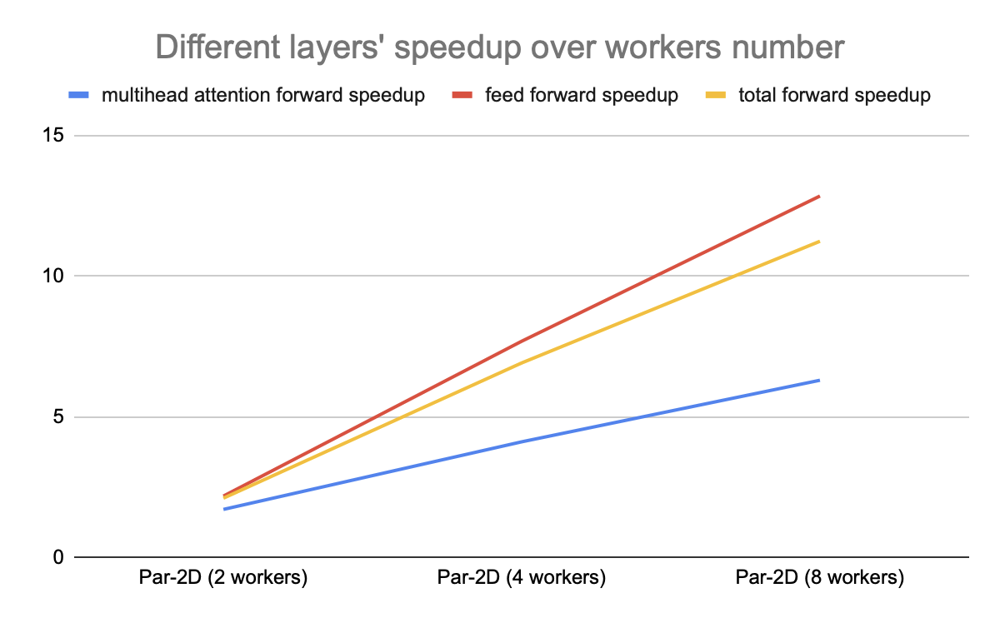

#### [Back to Peoject Page](../index.md)

## Milestone Report: Parallelizing Transformer with Model, Tensor Model and Pipeline Parallelism

Team Name: Extreme Weather

Team Member:

- Yadi Xiao (yadix@andrew.cmu.edu)
- Hao Ren (haoren@andrew.cmu.edu)

## URL

[https://xyd18.github.io/ExtremeWeatherProject/](https://xyd18.github.io/ExtremeWeatherProject/)

## Introduction

The goal of this project is to parallelize the training process of a Transformer layer in multicore CPU to achieve faster training times. The parallelization will leverage the tensor model parallelism and model parallelism in the Transformer layer and explore more advanced techniques such as pipeline parallelism for better scalability.

## Progress

We began our project by gaining a comprehensive understanding of the Transformer architecture [^1] and implemented a sequential version of the forward and backward method in C++. For data structure, we start with a Matrix structure that has 2 dimensions. This essentially means that we are computing one sentence (number of tokens \* model dimension), but not a batch of inputs. We followed the Transformer paper and finished the implementation of a sequential version of Transformer Encoding Layer, including Multi-head Attention Layer, Feed Forward Layer, Layer Normalization and residual connection, Dropout, Softmax and Cross Entropy Loss calculation in C++. We implemented both forward and backward pass (backward pass of multi-head attention layer is still a bit erroneous so we temporarily disabled it). We thus modify our goal from parallelizing Transformer's inference process to its training, since we have the backward implementation. 

Next, we parallelized Feed Forward Layer (using Tensor Model Parallelism) and Multi-head Attention Layer (Model parallelsim, with Tensor Model Parallelism for the last matrix multiplication after concatenation). Our implementation followed lecture slides and NVIDIA’s paper about Megatron LM [^2].

We also explore improving the performance of our implementation.We extended our implementation to accommodate a 3D input format, allowing for inputs with dimensions (batch_size, sequence_length, embedding_size/model_dimension). This enhancement provides greater flexibility in handling inputs of varying sizes and complexity, further advancing our parallelization efforts for the Transformer encoder layer. We think that adding batch dimensions would increase the arithmetic intensity of our program and thus achieve better performance. In the later part of our journey, we will conduct experiments to verify our hypothesis.

<figure>
 
 <figcaption>Transformer architecture</figcaption>
</figure>

To evaluate the performance of our parallelized implementation, we conducted a series of experiments to measure the speedup achieved in comparison to the 2D sequential version. These experiments were performed using randomly generated input data, and the speedup was assessed for configurations with 2, 4 and 8 MPI workers. The key parameters employed during these experiments were as follows:

- Input Dimension (input_dim): 512 — The dimensionality of the input representation.
- Hidden Dimension (hidden_dim): 2048 — The dimensionality of the hidden representation.
- Batch Size (batch_size): 10 — The number of input samples included in each batch.
- Number of Heads (num_heads): 8 — The number of attention heads in the multi-head attention sublayer.

## Preliminary Results

Our preliminary results demonstrate a promising speedup achieved by our parallelized implementation of the Transformer encoder layer. We conducted experiments to measure the speedup in the forward pass of two key components: the multi-head attention sublayer and the feedforward sublayer. Additionally, we assessed the total speedup achieved in the forward pass of the entire encoder layer. The experiments were carried out using varying numbers of MPI workers, specifically 2, 4, and 8 workers.

The following graph presents the speedup obtained for each component layer and the overall encoder layer for different configurations of MPI workers:

<figure>
 
 <figcaption>Speedup vs workers number</figcaption>
</figure>

## Goals and Deliverables

We are making steady progress toward achieving our primary goals, including the implementation of parallelized Transformer layer inference on distributed nodes, achieving a speedup in inference time, and conducting performance analysis. Generally we think we will be able to produce all our deliverables as stated in the proposal. In addition, we are optimistic about achieving some of our "nice to have" goals, such as the implementation of pipeline parallelism for deep Transformer models, if we continue to make progress ahead of schedule.

However, one thing that we think we are not able to achieve is implementing and testing parallel training on multiple GPUs. We think this requires extra CUDA implementations and we might not be able to complete them. Also, we had difficulty in running multiple GPUs on GHC and PSC machines. Hence, we are thinking that we can remove this goal, and focus on our Model and Pipeline parallelism on multiple CPUs.

### Plans for Poster Session

At the poster session, we plan to present the following:

1. A visual representation of the parallelization strategies employed in the Transformer layer.
2. Performance evaluation graphs that demonstrate the speedup achieved, scalability, and communication overhead of our parallel implementation.

## Issues and Concerns

One of our concerns is the limitation on the number of MPI workers, which is restricted by the number of attention heads. To effectively utilize computational resources, each MPI worker is ideally assigned at least one attention head. However, this restriction may limit the parallelization potential and scalability of our implementation, especially in cases where the number of available workers exceeds the number of attention heads.

An additional concern is whether we will have sufficient time to explore the use of multiple GPUs in addition to multicore CPUs for our parallel implementation. We are uncertain if transitioning from multicore CPUs to multiple GPUs will require significant modifications to our existing implementation, which could pose a challenge in terms of time and effort. We plan to assess the feasibility of this transition and determine the necessary steps to effectively leverage multiple GPUs for improved performance.

While we have made progress in implementing model parallelism and tensor model parallelism, we have not yet explored pipeline parallelism. Pipeline parallelism presents an opportunity to further improve scalability for deep Transformer models with multiple layers. We plan to investigate and implement this parallelism strategy if we are ahead of schedule.

## Updated Schedule

| Time                       | Plan                                                                                                                                                                                                          |
| -------------------------- | ------------------------------------------------------------------------------------------------------------------------------------------------------------------------------------------------------------- |
| April 1 - April 7  | (Completed) Understand transformer layer and implement a sequential version of the forward method                                                                                                                         |
| April 8 - April 14 | (Completed) Parallelize forward method of transformer using model parallelism and tensor model parallelism with MPI and implement a sequential version of the backward method                                                                          |
| April 15 - April 19        | (Partial Completed) Improve the parallelism and evaluate training/inference time on dataset                                                                                                                                       |
| April 20 - April 23        | 1. Fix bug in backward pass for multi-head attention layer. 2. Enhance model parallelism to support 3D inputs. 3. Conduct further code optimization and perform additional experiments to assess performance. |
| April 24 - April 26        | Implement Pipeline parallelism                                                                                                                                                                                |
| April 27 - April 30        | Finish Pipeline parallelism and conduct experiments on its performance. Also compare the parallelism with our Model parallelism implementation.                                                               |
| April 31 - May 2           | Visualize experimental results with graphs and initiate drafting of the final report.                                                                                                                         |
| May 3 - May 5              | Finalize the report and prepare the presentation.                                                                                                                                                             |

## Reference

[^1]: Vaswani, A., Shazeer, N., Parmar, N., Uszkoreit, J., Jones, L., Gomez, A. N., ... & Polosukhin, I. (2017). [Attention is all you need](https://arxiv.org/abs/1706.03762). _Advances in neural information processing systems, 30_.
[^2]: Shoeybi, M., Patwary, M., Puri, R., LeGresley, P., Casper, J., & Catanzaro, B. (2019). [Megatron-lm: Training multi-billion parameter language models using model parallelism](https://arxiv.org/abs/1909.08053). _arXiv preprint arXiv:1909.08053_.
