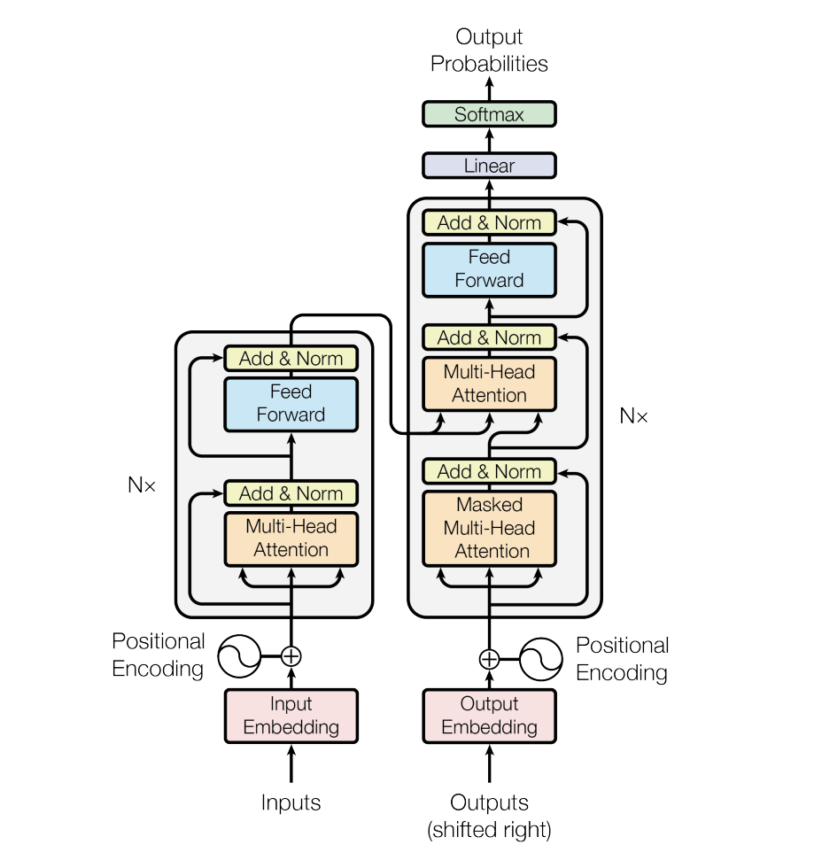

#### [Back to Peoject Page](../index.md)

## Title
Project Title: Parallelizing Transformer with Model and Pipline Parallelism


Team Name: Extreme Weather


Team Member:
- Yadi Xiao (yadix@andrew.cmu.edu)
- Hao Ren (haoren@andrew.cmu.edu)

## URL
[https://xyd18.github.io/ExtremeWeatherProject/](https://xyd18.github.io/ExtremeWeatherProject/)

## Summary

- The project aims to accelerate the inference process of Transformer encoder layers by parallelizing the computation across distributed GPUs or multicore CPU. 
- We will parallelize key components of the Transformer encoder layer, including Multi-Head Self-Attention, Position-wise Feed-Forward Network, and Layer Normalization, using *Model* and *Pipeline* parallelism. 
- We will experiment on multiple GPU and multicore CPU(on GHC and PSC machines) for distributed running of our Transformer encoder layer.

## Background

The Transformer architecture [^1] has become the foundation for many natural language processing (NLP) tasks and applications, including language translation, text generation, and language understanding. The Transformer model's success is primarily attributed to its ability to process sequences of data in parallel and learn long-range dependencies. However, as the scale of NLP tasks and the size of Transformer models grow, the computational demands of training and inference also increase, requiring parallelization across multiple GPUs to achieve satisfactory performance.

<center>
<figure>
  
  <figcaption>Transformer architecture</figcaption>
</figure>
</center>

The primary component of the Transformer architecture is the Transformer encoder layer, which consists of two sub-layers: the Multi-Head Self-Attention mechanism and the Position-wise Feed-Forward Network. Each Transformer encoder layer can processes input sequences (e.g., words or tokens) in parallel to capture contextual information.

The basic structure of a Transformer layer can be described as follows (in pseudocode):

```bash
function transformer_encoder_layer(input_sequence, attention_weights, feed_forward_weights):
    # Multi-Head Self-Attention sub-layer
    attention_output = multi_head_self_attention(input_sequence, attention_weights)

    # Add & Norm (residual connection and layer normalization)
    attention_output = layer_normalization(input_sequence + attention_output)

    # Position-wise Feed-Forward Network sub-layer
    feed_forward_output = feed_forward_network(attention_output, feed_forward_weights)

    # Add & Norm (residual connection and layer normalization)
    output_sequence = layer_normalization(attention_output + feed_forward_output)

    return output_sequence
```

The aspects of the Transformer layer that might benefit from parallelism are as follows:

1. Multi-Head Self-Attention (MHSA): The self-attention mechanism involves computing attention scores, followed by a softmax operation, and then a weighted sum of input values. This process is performed independently for multiple attention heads, creating opportunities for parallel computation.
   <center>
    <figure>
    
    <figcaption>Multi-Head Attention</figcaption>
    </figure>
    </center>
2. Position-wise Feed-Forward Network (FFN): The FFN applies the same feed-forward network to each position in the input sequence independently. We can use tensor model parallelism for this part.
   <center>
    <figure>
    
    <figcaption>Feed-Forward Network</figcaption>
    </figure>
    </center>
3. Layer Normalization: Layer normalization is applied independently to each position in the sequence, making it suitable for parallel execution.

4. Pipeline Parallelism: Different layers of the model can be assigned to different GPUs, allowing the concurrent execution of multiple layers.

In summary, the goal of this project is to parallelize the predicting process of a Transformer layer in distributed GPU or multicore CPU to achieve faster inference times. The parallelization will leverage the inherent data parallelism in the Transformer layer and explore techniques such as pipeline parallelism for better scalability.

## Challenge

While the Transformer architecture exhibits inherent parallelism, effectively parallelizing its computation across distributed nodes presents several challenges, some of which are described below:

1. Workload Dependencies:

    Pipeline Dependency: If pipeline parallelism is employed, there is a dependency between successive layers of the Transformer model. This dependency introduces communication overhead as the output of one layer must be communicated to the next layer on a different node.

2. Memory Access Characteristics

    Communication to Computation Ratio: Distributing computation across nodes introduces communication overhead, especially during data exchange in pipeline parallelism. Minimizing the communication-to-computation ratio is critical to achieving good parallel efficiency.

3. Load Imbalance

    Variable Sequence Lengths: In NLP tasks, input sequences can have variable lengths, leading to divergent execution across parallel units in pipeline parallelism. This divergence can lead to load imbalance and underutilization of computational resources.

4. System Constraints

    Limited GPU Memory: The memory capacity of individual GPUs may constrain the batch size and model size that can be loaded onto a single GPU. Efficient memory management and model partitioning are necessary to address this constraint.

Through this project, we hope to learn how to effectively address the above challenges and optimize the parallelization of Transformer layers in a distributed environment. In particular, we aim to explore techniques for reducing communication overhead, balancing computational loads, and exploiting data locality to achieve high parallel efficiency.

## Resources

1. Type of Computers:

    We will first use multicore CPU on GHC and PSC to run multipul processes in order to design data communication between nodes. Then we may use a cluster equipped with multiple GPUs for this project.

2. Starter Code:

    We will study existing implementation of the Transformer architecture, such as the one provided by the [Hugging Face Transformers library](https://github.com/huggingface/transformers) or the [PyTorch library](https://pytorch.org).

3. Reference Materials:

   - The original Transformer model paper, "Attention is All You Need" by Vaswani et al. (2017) [^1], will serve as a foundational reference for understanding the Transformer architecture.
   - Additionally, we may refer to other papers and articles that discuss parallelization strategies for the Transformer model, such as "Megatron-LM: Training Multi-Billion Parameter Language Models Using Model Parallelism" [^2].
   - [Model Parallelism — transformers 4.7.0 documentation](https://huggingface.co/transformers/v4.9.0/parallelism.html)

Overall, we plan to start from an existing code base and build upon it to implement our parallelization strategies for the Transformer layer. Our focus will be on enhancing the code to efficiently distribute the computation across multiple nodes and achieve accelerated inference performance.

## Goals & Deliverables

### Plan to Achieve

1. Implementation of parallelized Transformer layer inference on distributed nodes. This will involve parallelizing the key components of the Transformer layer, including Multi-Head Self-Attention, Position-wise Feed-Forward Network, and Layer Normalization.
2. Achieve a good speedup in the inference time of the Transformer layer when executed on multiple nodes compared to a single-node implementation. We aim for a minimum speedup of 3x with 4 machines. We think this goal is feasible given the parallelization potential of the Transformer layer and the reduction of computational bottlenecks.
3. Conduct a performance analysis to evaluate the scalability, efficiency, and communication overhead of our model implementation. This will include measuring the speedup achieved with varying numbers of nodes, batch sizes, and model sizes.
4. Provide documentation and codebase of the implemented parallel Transformer layer inference. This will include source code, comments, and a user guide to enable future work and reproducibility.

### Hope To Achieve (If ahead of schedule):

1. Investigate and implement pipeline parallelism in conjunction with data parallelism to further improve scalability for deep Transformer models with multiple layers.
2. Explore optimization techniques for reducing communication overhead, such as gradient accumulation and mixed-precision training, to further enhance performance.
3. Conduct a case study with a specific NLP application (e.g., machine translation, text generation) to demonstrate the practical impact of the optimized parallel implementation on a real-world task.

In case the work goes more slowly, our primary focus will remain on achieving parallelization and speedup of the Multi-Head Self-Attention component, as it is the most computationally intensive part of the Transformer layer.

### Poster Session Demo:

At the poster session, we plan to present the following:

1. A visual representation of the parallelization strategies employed in the Transformer layer.
2. Performance evaluation graphs that demonstrate the speedup achieved, scalability, and communication overhead of our parallel implementation.

In summary, the primary goal of this project is to deliver an optimized parallel implementation of Transformer layer inference on distributed nodes, achieving a significant speedup and scalability. We aim to demonstrate the effectiveness of our approach through comprehensive performance analysis and real-world application demos.

## Platform Choice

The chosen platform for this project is GHC, which can provide multicore CPU and PSC, which can provide multiple GPUs. We will use Python along with PyTorch and cuda. This platform choice is advantageous for the following reasons:

1. GPU Acceleration: The Transformer layer involves compute-intensive matrix multiplication operations, especially in the Multi-Head Self-Attention (MHSA) sub-layer. GPUs are well-suited for these types of operations due to their highly parallel architecture and ability to perform thousands of arithmetic operations simultaneously. This makes GPUs a natural choice for accelerating the Transformer layer's computation.
2. Scalability: By employing a distributed computing cluster with multiple GPUs, we can achieve scalability in the parallelization of Transformer layer inference. Distributed GPUs offer the capacity to process larger batch sizes and larger models, and we can explore techniques such as data parallelism and pipeline parallelism to distribute the workload efficiently across multiple GPUs.
3. Deep Learning Frameworks: PyTorch is widely-used deep learning frameworks that provide built-in support for GPU acceleration, distributed training, and automatic differentiation. By building upon these frameworks, we can leverage existing optimizations and focus on implementing our parallelization strategies.

Overall, the chosen platform aligns well with the computational demands of the Transformer layer and provides the necessary tools and resources to implement and evaluate our parallelization strategies. The combination of distributed nodes and deep learning frameworks enables us to effectively leverage parallelism and accelerate the inference process of the Transformer layer.

## Schedule

| Time                | Plan                                                                                |
| ------------------- | ----------------------------------------------------------------------------------- |
| April 1 - April 7   | Understand transformer layer, set up environment and implement a sequential version |
| April 8 - April 14  | Parallelize transformer using model parallelism with MPI and CUDA                                          |
| April 15 - April 19 | Improve the parallized version and evaluate training/inference time on dataset      |
| April 20 - April 25 | If ahead of schedule, implement pipeline parallelism for deep Transformer models    |
| April 26 - May 1    | Perform analysis and benchmarks on finalized models                                 |
| May 1 - May 5       | Finish report and presentation                                                      |

## Reference

[^1]: Vaswani, A., Shazeer, N., Parmar, N., Uszkoreit, J., Jones, L., Gomez, A. N., ... & Polosukhin, I. (2017). [Attention is all you need](https://arxiv.org/abs/1706.03762). _Advances in neural information processing systems, 30_.
[^2]: Shoeybi, M., Patwary, M., Puri, R., LeGresley, P., Casper, J., & Catanzaro, B. (2019). [Megatron-lm: Training multi-billion parameter language models using model parallelism](https://arxiv.org/abs/1909.08053). _arXiv preprint arXiv:1909.08053_.